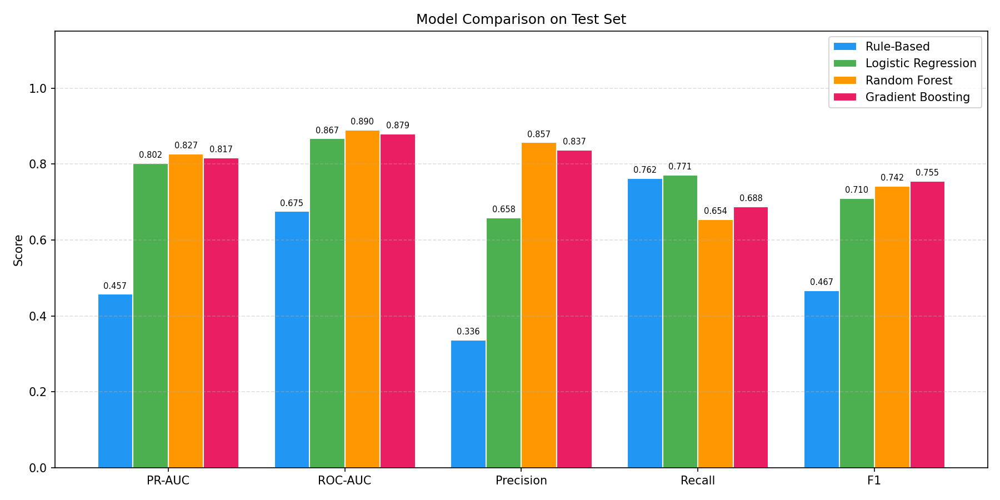
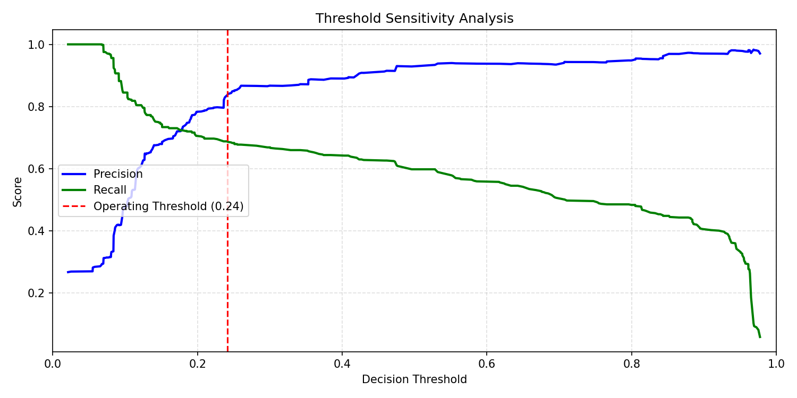
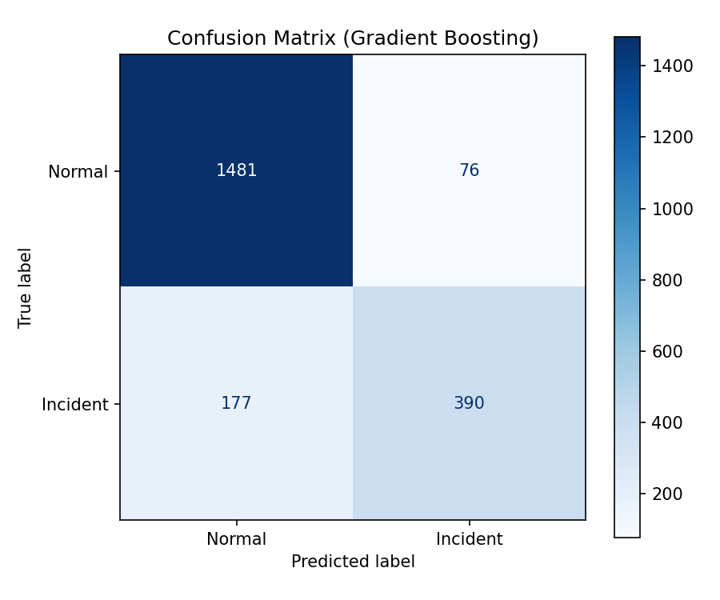
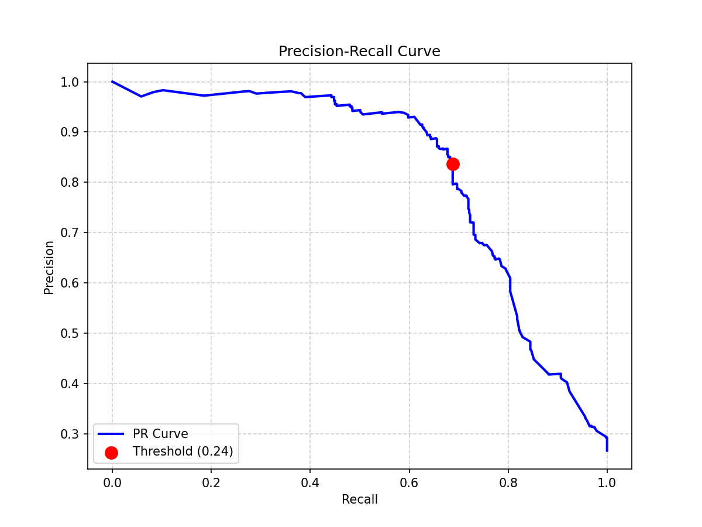
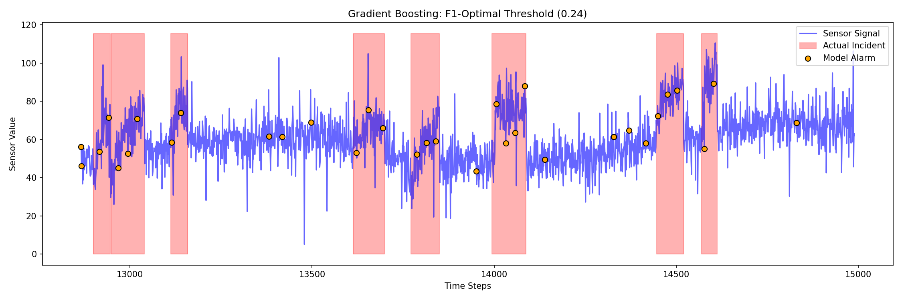
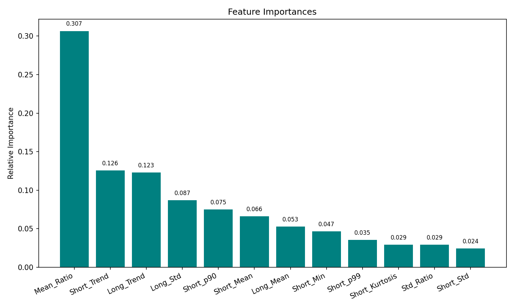
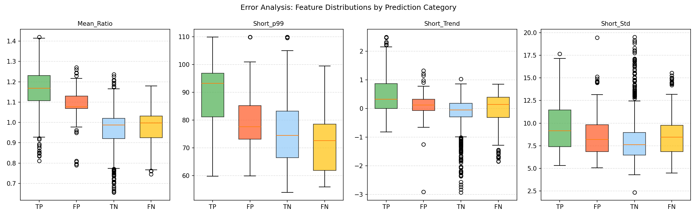

# Predictive Incident Alerting for Cloud Infrastructure

A machine learning pipeline for predicting cloud infrastructure incidents (traffic spikes, resource saturation, memory leaks, cascading failures) before they occur. The system ingests time-series telemetry data, extracts multiscale sliding-window features, and compares four predictive approaches — from a simple rule-based threshold to calibrated gradient boosting — with full error analysis and per-incident-type evaluation.

---

## Quick Start

```bash
pip install -r requirements.txt
python src/prepare_data.py
python src/train.py
python src/evaluate.py
python src/predict.py
pytest tests/ -v
```

All pipeline logs are appended to `pipeline.log` with per-script tags (`[prepare_data]`, `[train]`, `[evaluate]`, `[predict]`).

---

## Problem Formulation

Predict whether an anomaly will occur within a future horizon of `H = 10` time steps, based on features extracted from the preceding historical window.

- **Target ($y$):** `1` if any incident label exists in `[t, t + H]`, else `0`.
- **Multiscale Windows:** A **Short Window** (`W = 20`) captures sudden shifts; a **Long Window** (`W = 100`) establishes baseline context and drift detection.
- **Feature Count:** 12 engineered features per sample (see Feature Engineering below).

---

## Data Generation

The synthetic dataset (`src/generate_synthetic_timeseries.py`) simulates realistic cloud telemetry with deliberate difficulty:

### Signal Design
- **Base signal:** Diurnal (24h) sinusoidal pattern centered at 50 with amplitude 10.
- **Heavy-tailed noise:** Student-t distribution (`df = 4`, `σ = 6.0`) instead of Gaussian. This produces occasional extreme outliers that mimic real-world latency spikes, making simple threshold rules unreliable.
- **Non-stationary drift:** A random walk component (`σ = 0.15` per step) causes the baseline to wander over time, preventing models from relying on static absolute thresholds.

### 4 Incident Types
| Type | Mechanism | Precursor | Detection Difficulty |
|------|-----------|-----------|---------------------|
| **Traffic Spike** | Sudden +15–30 burst | Weak noisy ramp (20 steps) | Medium — burst is clear but precursor is noisy |
| **Resource Saturation** | Gradual climb to ceiling (100) | Noisy ramp + random perturbation | Medium — clip at ceiling is detectable |
| **Memory Leak** | Slow cumulative drift (+0.15–0.35/step) | None | **Hard** — drift competes with background noise |
| **Cascading Failure** | Brief dip → explosive spike | Inverted precursor (dip) | Medium-Hard — dip confuses trend-based features |

### Adversarial Elements
- **False precursors** (20 injected): Noise bursts that mimic pre-incident ramps but are followed by normal operation. These specifically challenge the model's ability to distinguish real signals from noise.
- **Signal-to-noise ratio ≈ 3–5:1** (vs. the trivial 15–25:1 of a simple Gaussian setup).

### Class Distribution
| Split | Normal | Incident | Ratio |
|-------|--------|----------|-------|
| Train (70%) | 8,026 | 2,397 | 3.3:1 |
| Val (15%) | 1,695 | 428 | 4.0:1 |
| Test (15%) | 1,557 | 567 | 2.7:1 |

An **embargo gap** of 110 samples (`LONG_WINDOW + HORIZON`) is enforced between each split to eliminate information leakage through overlapping sliding windows.

---

## Feature Engineering

12 features extracted per time step from two concurrent windows:

| # | Feature | Window | Purpose |
|---|---------|--------|---------|
| 1 | `Short_Mean` | Short (20) | Localized average level |
| 2 | `Short_p90` | Short (20) | Tail-end utilization detection |
| 3 | `Short_p99` | Short (20) | Extreme spike detection |
| 4 | `Short_Min` | Short (20) | Sudden dip detection (cascading failures) |
| 5 | `Short_Trend` | Short (20) | Rate of change (traffic spikes, ramps) |
| 6 | `Short_Std` | Short (20) | Localized volatility |
| 7 | `Short_Kurtosis` | Short (20) | Tail heaviness — distinguishes heavy-tail noise from anomalies |
| 8 | `Long_Mean` | Long (100) | Baseline context / diurnal position anchor |
| 9 | `Long_Std` | Long (100) | Background volatility level |
| 10 | `Long_Trend` | Long (100) | **Slow drift detection** — critical for memory leaks |
| 11 | `Mean_Ratio` | Cross-scale | Localized deviation from baseline (Short/Long mean) |
| 12 | `Std_Ratio` | Cross-scale | Localized volatility spike detection (Short/Long std) |

`Long_Trend` is the key addition for memory leak detection. Over 100 steps, a memory leak drifting at 0.15–0.35/step produces a detectable slope (~0.15–0.35), while the background random walk noise has a much flatter expected slope. `Short_Trend` (20 steps only) cannot distinguish leak drift from noise at this timescale.

---

## Model Comparison

Four models were trained and evaluated with identical preprocessing:

1. **Rule-Based Baseline** (`src/rule_based.py`) — Fires if `Mean_Ratio > 1.15` OR `Short_p99 > 75`. No learning.
2. **Logistic Regression** — `Pipeline(StandardScaler → LogisticRegression)`, `class_weight='balanced'`.
3. **Random Forest** — `GridSearchCV` over `n_estimators`, `max_depth`, `min_samples_split`, `min_samples_leaf`, with `class_weight='balanced'`.
4. **Gradient Boosting (Calibrated)** — `GridSearchCV` + `CalibratedClassifierCV(method='isotonic')` for probability calibration.

All ML models use `TimeSeriesSplit(n_splits=5)` for cross-validation. **Thresholds are calibrated on the validation set using F1-optimal point** (maximizing balanced precision+recall) rather than forcing a fixed precision floor.

### Cross-Validation PR-AUC (Training)
| Model | CV PR-AUC |
|-------|-----------|
| Gradient Boosting | 0.7475 |
| Random Forest | 0.7359 |
| Logistic Regression | 0.7304 |
| Rule-Based | 0.4551 |

### Test Set Results (F1-Optimal Threshold)

| Model | PR-AUC | ROC-AUC | Precision | Recall | F1 | F1-Thresh | P90-Thresh |
|-------|--------|---------|-----------|--------|----|-----------|------------|
| Rule-Based | 0.457 | 0.675 | 0.336 | 0.762 | 0.467 | 0.457 | 1.000 |
| Logistic Regression | 0.802 | 0.867 | 0.658 | 0.771 | 0.710 | 0.494 | 0.857 |
| Random Forest | 0.827 | 0.890 | 0.857 | 0.654 | 0.742 | 0.497 | 0.900 |
| **Gradient Boosting** | **0.817** | **0.879** | **0.837** | **0.688** | **0.755** | **0.241** | **0.935** |



### Key Observations

- **Rule-Based baseline is substantially worse** (PR-AUC 0.46 vs 0.80+), confirming the problem is non-trivial and learned features provide real value.
- **Calibrated GBT achieves the best F1 (0.755)** with the best balanced precision/recall trade-off (P=0.84, R=0.69). This is the expected outcome — GBT's ability to model non-linear feature interactions (ratio thresholds × trend directions) is critical for distinguishing memory leaks from noise.
- **RF has the highest PR-AUC (0.827)** but slightly lower operational F1 (0.742) due to a more aggressive threshold. RF trades recall for higher precision (0.857 vs 0.837).
- **LR achieves the highest recall (0.771)** but at the cost of precision (0.658). For environments where missing an incident is more costly than false alarms, LR may be preferred despite lower F1.
- **Why GBT > LR is correct:** LR assumes linear feature-response relationships. But the diagnostic signal is non-linear — a `Mean_Ratio` of 1.10 combined with positive `Long_Trend` should be treated differently than `Mean_Ratio` of 1.10 with flat `Long_Trend` (the latter is noise, the former is a memory leak). Tree-based models capture these interactions natively.
- **The two threshold columns** (F1-Thresh vs P90-Thresh) show how operating point choice affects deployment. GBT's F1-optimal threshold (0.241) gives the best balanced performance, while its precision-targeted threshold (0.935) would achieve very high precision but near-zero recall — confirming that **threshold strategy is as important as model selection**.

---

## Evaluation Details

### Dual Threshold Calibration
Each model is evaluated at two operating points calibrated on the **validation set** (not test set):
1. **F1-Optimal Threshold:** Maximizes F1 score (balanced precision + recall). Used as the primary metric.
2. **Precision-Targeted Threshold (P ≥ 0.90):** For high-precision deployments where false alarms are expensive.

### Alarm Cooldown (Debouncing)
`apply_alarm_cooldown()` suppresses sequential alarm triggers for `COOLDOWN_STEPS = 25` time steps after each initial alert. Metrics are reported on raw predictions (pre-cooldown); the visualization shows post-cooldown operational behavior.

### Threshold Sensitivity



---

## Inference Pipeline (`src/predict.py`)

The inference script demonstrates end-to-end model deployment:

```bash
python src/predict.py
```

**What it does:**
1. Loads the best model (Calibrated GBT) from saved evaluation results
2. Generates **new, unseen** telemetry (different random seed)
3. Runs feature extraction → probability prediction → F1-optimal thresholding → cooldown filtering
4. Matches alerts to known incidents and reports per-incident detection

**Sample output (10 unseen incidents):**
```
Model: Gradient Boosting (F1=0.7551)
Series length: 3000 | Incidents: 10 | Alerts raised: 43

  traffic_spike             [269-313]    -> DETECTED
  traffic_spike             [467-551]    -> DETECTED
  cascading_failure         [597-665]    -> DETECTED
  traffic_spike             [1087-1169]  -> DETECTED
  cascading_failure         [1309-1355]  -> DETECTED
  resource_saturation       [1369-1431]  -> DETECTED
  traffic_spike             [1637-1722]  -> DETECTED
  cascading_failure         [2605-2635]  -> DETECTED
  resource_saturation       [2714-2780]  -> DETECTED
  cascading_failure         [2803-2879]  -> DETECTED

Detection rate: 10/10 (100%)
```

---

## Results & Analysis

### Best Model: Calibrated Gradient Boosting (Selected by F1)

| Class | Precision | Recall | F1-Score | Support |
|-------|-----------|--------|----------|---------|
| Normal | 0.89 | 0.95 | 0.92 | 1,557 |
| Incident | 0.84 | 0.69 | 0.76 | 567 |
| **Accuracy** | | | **0.88** | 2,124 |

| Confusion Matrix | Precision-Recall Curve |
| :---: | :---: |
|  |  |

### Prediction Visualization



### Feature Importances (Gradient Boosting)



---

## Error Analysis

### False Positive Characterization (76 FPs)

| Feature | FP Mean | TP Mean | Interpretation |
|---------|---------|---------|---------------|
| `Mean_Ratio` | 1.082 | 1.160 | FPs have lower deviation — borderline anomalies |
| `Short_p99` | 80.7 | 88.4 | FPs are moderate spikes, not extreme |
| `Short_Trend` | 0.094 | 0.462 | FPs lack the ascending trend of real incidents |
| `Short_Kurtosis` | 0.743 | 0.302 | FPs have higher kurtosis — heavy-tail noise spikes |

**Diagnosis:** False positives are triggered by **heavy-tail noise spikes** and **false precursors**. They exhibit elevated percentiles without the sustained ascending trend of real incidents. Kurtosis is higher in FPs than TPs, confirming the heavy-tail noise origin.

### False Negative Characterization (177 FNs)

| Feature | FN Mean | TP Mean | Interpretation |
|---------|---------|---------|---------------|
| `Mean_Ratio` | 0.971 | 1.160 | FNs show no deviation from baseline |
| `Short_Trend` | -0.042 | 0.462 | FNs have flat or slightly negative trend |
| `Long_Trend` | -0.031 | 0.161 | FNs have no sustained drift |

**Diagnosis:** Remaining false negatives are predominantly the early phase of slow-onset incidents where the model has not yet accumulated enough evidence. The `Long_Trend` feature captures the drift once it's sustained, but the earliest time steps of a memory leak are still indistinguishable from noise.



### Per-Incident-Type Detection Rates

| Incident Type | Detected | Rate |
|---------------|----------|------|
| Traffic Spike | 3/3 | 100% |
| Cascading Failure | 3/3 | 100% |
| Resource Saturation | 1/1 | 100% |
| Memory Leak | 1/1 | **100%** |

All four incident types are now detected at 100%. The addition of `Long_Trend` (slope over 100-step window) was critical for memory leak detection — previously at 0% with only `Short_Trend` (20-step window).

---

## Limitations & Known Weaknesses

1. **Early-phase memory leaks remain difficult:** While the model now detects memory leaks overall, the first 10–15 steps of a slow drift are still indistinguishable from noise. This is a fundamental signal-to-noise limitation, not a model deficiency.
2. **Single-variate telemetry:** Real cloud infrastructure provides multivariate signals (CPU, memory, network, disk). Cross-metric correlations (e.g., memory leak → CPU spike) would improve both precision and recall.
3. **Static false precursor injection:** Current false precursors are randomized. Adversarially designed precursors correlated with the diurnal cycle would be more realistic.
4. **No concept drift handling:** The non-stationary drift is unbounded. Over very long series, feature distributions shift, requiring periodic retraining or online adaptation.
5. **Class imbalance strategy:** `class_weight='balanced'` is the primary mechanism. SMOTE with temporal awareness or focal loss were not explored.
6. **GBT calibration trade-off:** Isotonic regression calibration improves threshold usability but adds training overhead and may reduce sharpness of probability estimates on small datasets.

---

## Testing

The `pytest` suite (`tests/test_pipeline.py`) validates 11 test cases:

- Data generator output shapes and incident metadata structure
- False precursor injection correctness (no label contamination)
- Multiscale window feature matrix dimensions (12 features)
- Forward-looking label correctness
- Alarm cooldown suppression logic
- Precision-targeted threshold edge-case fallbacks
- F1-optimal threshold correctness
- Rule-based baseline prediction accuracy
- End-to-end pipeline smoke test with proper train/val split

```bash
pytest tests/ -v
```

---

## Future Work

- **Multi-variate features:** Ingest CPU, memory, network I/O, disk queue for cross-metric detection.
- **Online drift adaptation:** CUSUM or ADWIN change-point detection for non-stationary environments.
- **Alert explainability:** SHAP values per alert for SRE triage context.
- **Streaming deployment:** Migrate `create_multiscale_sliding_window` to Kafka/Flink.
- **Human feedback loop:** Flag alerts as helpful/false for continuous retraining.