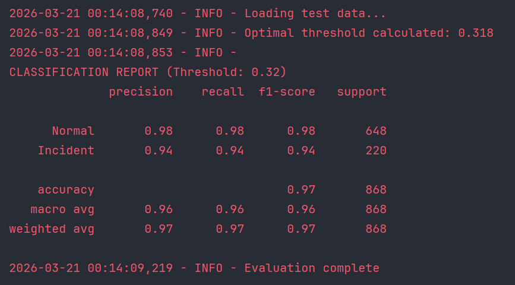
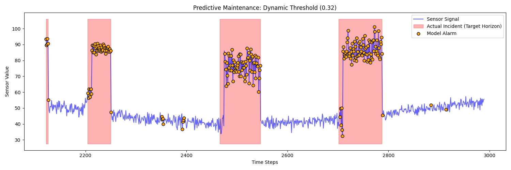
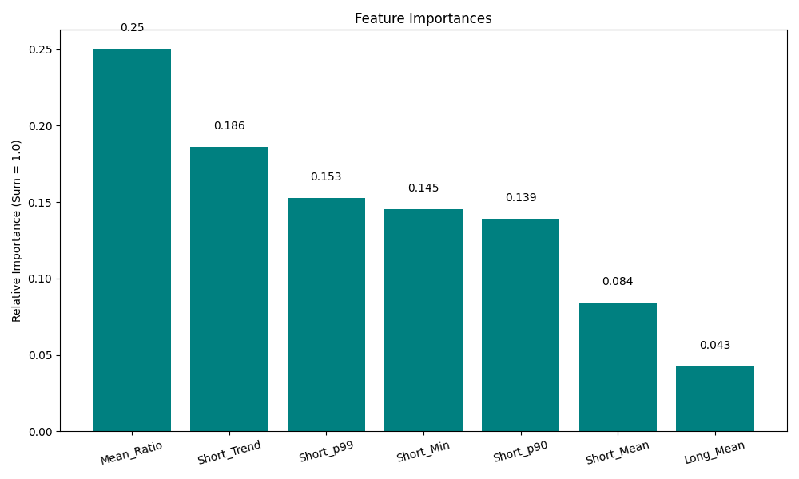

# Predictive Incident Alerting for Cloud Infrastructure

This project implements a machine learning-based alerting system designed to predict imminent cloud infrastructure incidents (e.g., resource saturation, traffic spikes) before they occur. The model analyzes time-series telemetry data using a multiscale sliding-window approach to provide Site Reliability Engineering (SRE) teams with high-precision early warnings, actively minimizing alert fatigue.

---


## Quick Start / How to Run

This project is broken down into a modular, sequential pipeline. To run the full pipeline from scratch, execute the following scripts in order:

**1. Prepare the Data**

Generates the synthetic cloud metrics, extracts the multiscale sliding-window features, and creates the train/test splits.
```bash
python prepare_data.py
```
(Note: This will automatically create the data/ and models/ directories.)

**2. Train the Model**

Loads the training data, performs hyperparameter tuning using TimeSeriesSplit to prevent temporal leakage, and saves the optimized Gradient Boosting/Random Forest model.

```bash
python train.py
```

**3. Evaluate the Model**

Loads the test set and the saved model, calculates the optimal high-precision threshold, and outputs the classification report along with the feature importance and prediction plots.

```bash
python evaluate.py
```

-----

## Problem Formulation

The goal is to predict whether an anomaly or threshold breach will occur within a future horizon of `H` time steps, based on the historical context of the preceding `W` time steps. 

This is formulated as a binary classification problem using a **sliding-window architecture**:
* **Target ($y$):** $1$ if an incident occurs anywhere in the prediction horizon `[t, t + H]`, otherwise $0$.
* **Input Matrix ($X$):** Extracted features from the historical window `[t - W, t]`.
* **Multiscale Windows:** To capture both local anomalies and global context, the model extracts features from two concurrent windows ending at time `t`: a **Short Window** (`W = 20`) to capture sudden behavioral shifts, and a **Long Window** (`W = 100`) to establish a baseline.

---

## Data Generation

To train and evaluate the model, a synthetic cloud telemetry dataset was generated (`generate_synthetic_timeseries.py`). The data simulates normal diurnal (daily) traffic patterns overlayed with gaussian noise and injects two specific types of SRE incidents:
1.  **Traffic Spikes:** Sudden, high-variance leaps in latency or utilization.
2.  **Resource Saturation:** A gradual climb that hits a strict mathematical ceiling (e.g., 100% CPU or Memory utilization).

---

## Modeling Choices & Feature Engineering

### SRE-Specific Features
Raw time-domain statistics (like Max/Min) are often insufficient for noisy cloud environments. Instead, the feature engineering pipeline extracts SRE-focused metrics:
* **Percentiles (p90, p99):** Captures tail-end latency or utilization spikes without overreacting to single-point outliers.
* **Trend Slopes:** Calculates the rate of change. A rapid upward slope in memory usage is often more dangerous than a high static baseline.
* **Contextual Ratios:** Calculates the ratio of the Short Window mean against the Long Window mean (`Mean_Ratio`). This provides the model with localized context, helping it differentiate between a problematic spike and a normal peak-hours traffic wave.

### Model Selection
The core model is a **Random Forest Classifier**.
* **Why Random Forest over Gradient Boosting (XGBoost)?** During optimization, an XGBoost architecture was tested. However, on this specific dataset (small data size, high simulated noise, rare anomalies), XGBoost proved prone to overfitting the training noise and crashing on anomaly-free cross-validation folds. Random Forest natively smoothed over the noise and provided vastly superior robustness. In the interest of production stability, the simpler Random Forest was selected.
* **Preventing Temporal Leakage:** Hyperparameter tuning (`GridSearchCV`) utilizes `TimeSeriesSplit` rather than standard K-Fold cross-validation. This strictly enforces chronological training boundaries, ensuring the model never "peeks" at future data.
* **Optimizing for PR-AUC:** The model is optimized using `average_precision` rather than standard F1-score. This forces the algorithm to maximize Area Under the Precision-Recall Curve, which is critical for imbalanced anomaly detection.

---

## Evaluation Setup

In cloud operations, false positives cause "alert fatigue," leading engineers to ignore pagers. Therefore, the evaluation setup strictly prioritizes **Precision**.

* **Dynamic Alert Thresholds:** Instead of using a default `0.5` probability threshold, the evaluation script (`evaluate.py`) analyzes the Precision-Recall curve to find the lowest possible probability threshold that guarantees a target precision of ~0.90. This extracts the maximum possible recall while strictly enforcing reliability.
* **Alarm Cooldowns (Debouncing):** To prevent alert spam during a continuous incident, an `apply_alarm_cooldown` function silences sequential model triggers for a set number of steps after the initial alert fires.

---

## Results & Analysis

*Note: Because the time-series data and system noise are generated synthetically, exact evaluation metrics may fluctuate slightly (typically between 0.90 and 0.95 F1) on subsequent runs unless the random seed is fixed.*

The model was evaluated on a chronologically held-out test set. 

**Key Metrics (at optimal dynamic threshold of 0.32):**
* **Precision:** 0.94 (94% of alerts fired are genuine impending incidents)
* **Recall:** 0.94 (Successfully caught 94% of incident windows)
* **F1-Score:** 0.94


*Output of the classification report and dynamic threshold calculation.*

### Visualizing the Alerts
The plot below demonstrates the model successfully predicting both sudden spikes and slow resource saturation anomalies, while ignoring the normal diurnal wave pattern and baseline noise.



### Implemented "Smart" Feature Pruning
An analysis of the Random Forest feature importances reveals that short-term SRE features (`Short_p90`, `Short_Trend`, `Short_p99`) and contextual ratios (`Mean_Ratio`) dominate the decision-making process. 



To optimize the inference pipeline for production, dead-weight absolute long-term statistics (like `Long_Min` and `Long_p90`) were aggressively pruned. However, `Long_Mean` was strategically retained despite a lower Gini importance score, as empirical testing proved it acts as a critical anchor for the model to understand where it is within the daily diurnal cycle.
